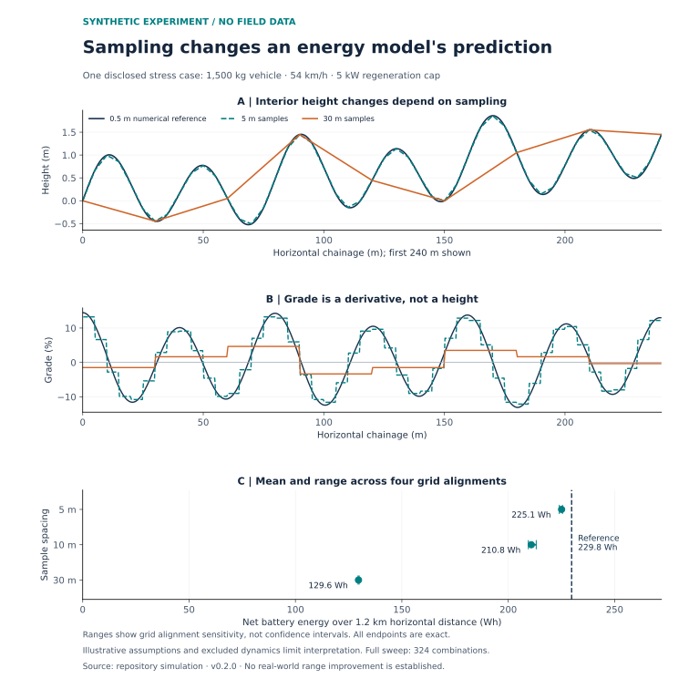

# EV Micro-Gradient Mapping

### Measuring road geometry and testing its value for EV energy prediction

**Ajinkya Kawade · Independent technical whitepaper · Version 0.2.0 · 21 September 2026**

Original concept: July 2026. **Research proposal with a synthetic demonstration; no field validation or peer review is claimed.**

## The idea, in plain language

Two routes with similar distances can use different amounts of battery energy. Climbing, descending, vehicle speed, wind, tyres and braking all matter. This project asks whether measuring short changes in road slope—and eventually road-surface behaviour—can improve those predictions enough to justify collecting the extra data.

The proposed system uses mapping vehicles to collect road observations. GNSS positioning, inertial sensors and optional LiDAR would estimate road geometry. Microphones would be evaluated as clues about the surface. Separate force or energy measurements would be needed to test whether those clues predict rolling losses.

The key question is measurable: **Does adding this information reduce energy-prediction error on roads and vehicles that were not used to calibrate the model?**

## Read the research

| Resource | What it contains |
|---|---|
| [Technical whitepaper](paper/whitepaper.md) | Related work, corrected physics, proposed sensor architecture, uncertainty analysis and integration design |
| [Field-validation protocol](paper/validation-protocol.md) | Baselines, calibration, independent measurements, held-out evaluation and decision criteria |
| [Claim audit](paper/claim-audit.md) | What changed from the July draft and why |
| [References](paper/references.md) · [BibTeX](references.bib) | Research papers, official specifications and documentation |
| [Synthetic results](results/README.md) | A reproducible numerical example and all 324 sensitivity scenarios |
| [Example data contract](data/README.md) | Units, provenance, uncertainty and a synthetic road-segment record |

## What the demonstration establishes

The included model compares a known synthetic road profile with more coarsely sampled versions. It accounts for gravity, rolling resistance, aerodynamic drag, separate driving/regeneration efficiencies, a regeneration power limit and auxiliary loads.



Coarse sampling can alter calculated energy even when endpoint heights match. In the lossless limit, however, gravity depends only on the net height change. Both facts matter. A higher predicted power peak alone does not prove a larger total energy requirement.

The numerical sweep varies slope amplitude, speed, sample spacing, grid alignment and regeneration limits. It includes a constant-grade control and a reference-resolution check. The plotted profile is an intentionally undulating stress case; **its numerical differences are not estimates of real-world range gains or of Copernicus/SRTM error**. [Methods and limitations](paper/whitepaper.md#8-reproducible-synthetic-demonstration)

## Reproduce it

The model and its tests use only the **Python 3.10+ standard library**. From the repository root:

```bash
python code/run_demo.py
python -m unittest discover -s tests -v
```

To regenerate the optional figure:

```bash
python -m pip install -r requirements-figures.txt
python code/plot_results.py
```

The numerical outputs are saved under `results/`. Tests check analytical solutions, regeneration limits and energy conservation; they do not validate a physical sensor system.

## Current scope

- Implemented: a small energy model, synthetic sensitivity experiment, physics tests and a proposed data contract.
- Proposed: sensor fusion, LiDAR processing, acoustic calibration, field collection and routing integration.
- Open research questions: how much useful accuracy survives measurement noise, how well models transfer between vehicles, and which sensors justify their cost.

## Citation and history

Kawade, A. (2026). *Road Geometry and Surface-Resistance Mapping for EV Energy Prediction: A Sensor Architecture and Validation Framework* (Version 0.2.0). Independent technical whitepaper with synthetic demonstration. [GitHub repository](https://github.com/ajinkyakawade500/EV-micro-gradient-mapping).

Machine-readable citation: [CITATION.cff](CITATION.cff). Revision details: [CHANGELOG.md](CHANGELOG.md). Authorship and AI assistance: [provenance statement](paper/provenance.md). The [July draft remains in Git history](https://github.com/ajinkyakawade500/EV-micro-gradient-mapping/blob/63d8c3819836abadf38ca3d4c4fbe695e930bc81/README.md).

## License

Original repository material remains under [CC0 1.0](LICENSE). CC0 does not waive patent or trademark rights and does not determine freedom to operate. Referenced papers and any future external datasets retain their own terms. See [Creative Commons' legal text](https://creativecommons.org/publicdomain/zero/1.0/legalcode.en#s4).
